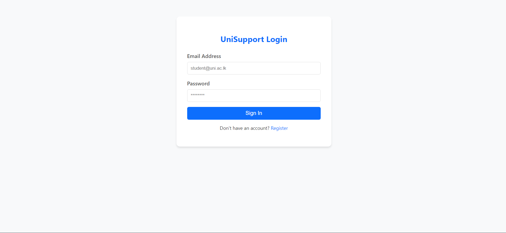
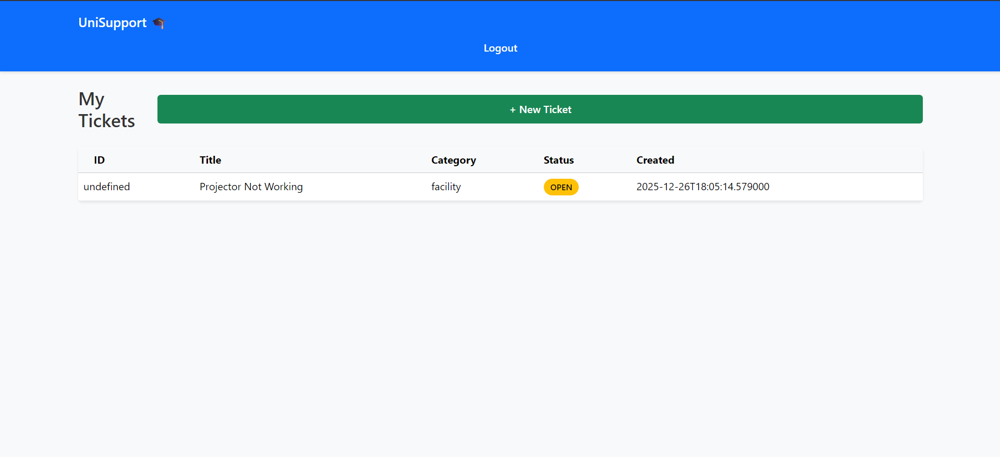
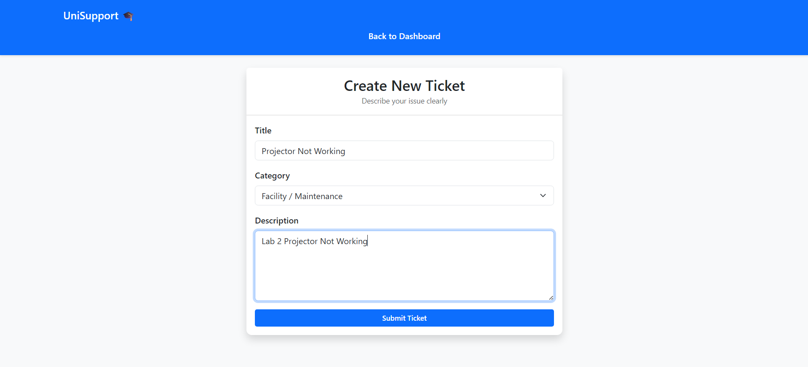
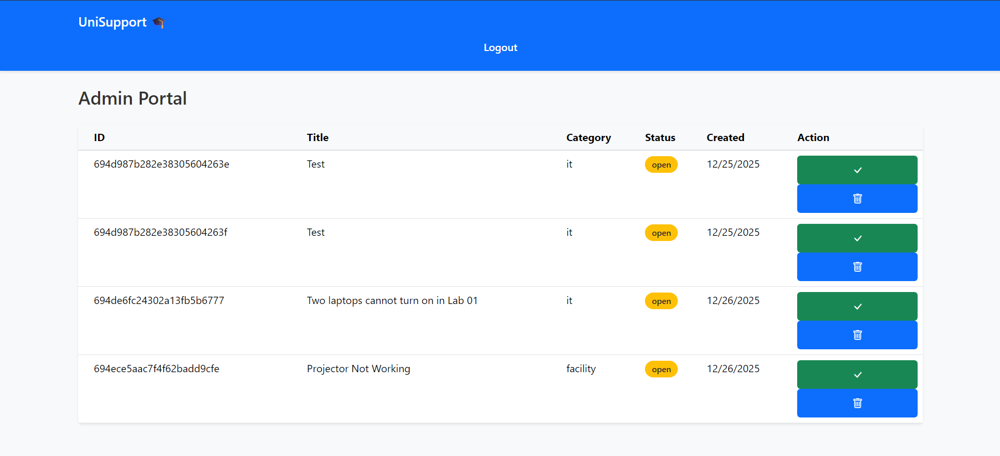

# 🎓 University Help Desk

A full-stack **Student Support Ticket System** designed to streamline communication between university students and support staff. This application allows students to report issues (IT, Facility, Academic), track their resolution status in real-time, and provides a secure, role-based environment for managing inquiries.


---

## ✨ Features

### 🔐 Authentication & Security
* **User Registration:** Secure sign-up flow for students with full name, email, and password.
* **JWT Authentication:** Implements OAuth2 with Password (Bearer) flow for secure session management.
* **Password Hashing:** Uses `bcrypt` and `passlib` to encrypt user passwords before storage.
* **Auto-Logout:** Frontend automatically handles expired tokens for security.

### 🎫 Ticket Management
* **Create Tickets:** Simple interface to submit issues with specific categories (IT Support, Facility, Academic).
* **Real-time Dashboard:** Students can view all their active tickets in a centralized dashboard.
* **Status Tracking:** Color-coded badges (Open, In Progress, Resolved) provide instant visual status updates.
* **Ticket Details:** Dedicated view for deep-diving into ticket specifics, creation dates, and descriptions.

---

## 🛠️ Tech Stack

### Backend
* **Framework:** [FastAPI](https://fastapi.tiangolo.com/) (Python) - High-performance, easy-to-learn web framework.
* **Database:** [MongoDB Atlas](https://www.mongodb.com/atlas) - Cloud-hosted NoSQL database.
* **ODM:** [Motor](https://motor.readthedocs.io/) - Asynchronous Python driver for MongoDB.
* **Security:** `python-jose` (JWT tokens) and `passlib` (Hashing).

### Frontend
* **Structure:** Semantic HTML5.
* **Styling:** [Bootstrap 5](https://getbootstrap.com/) & Custom CSS.
* **Logic:** Vanilla JavaScript (ES6 Modules) for API communication and DOM manipulation.
* **Hosting:** Netlify (Frontend) & Render (Backend).

---

## 📸 Screenshots

| Login Page | Student Dashboard |
|:---:|:---:|
|  |  |

| Create Ticket | Ticket Details |
|:---:|:---:|
|  |  |
## 🚀 Getting Started

---

Follow these instructions to get a copy of the project up and running on your local machine for development and testing purposes.

### Prerequisites
* Python 3.10+
* MongoDB Account (or local instance)
* Git

### 1. Clone the Repository
```bash
git clone [https://github.com/codegallery-me/University-Help-Desk.git](https://github.com/codegallery-me/University-Help-Desk.git)
cd University-Help-Desk